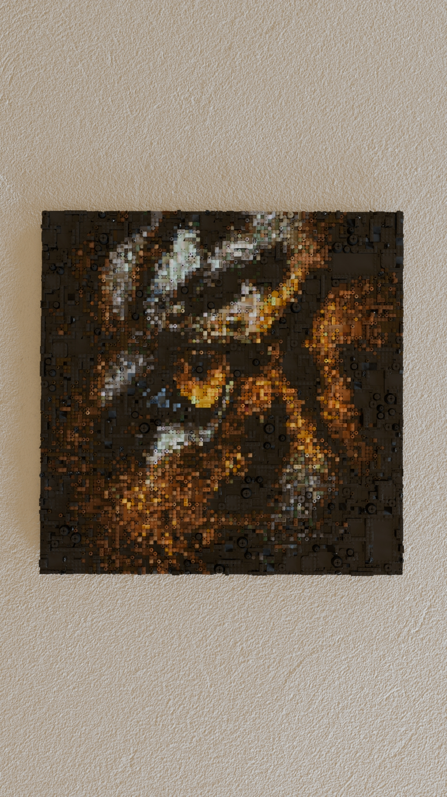
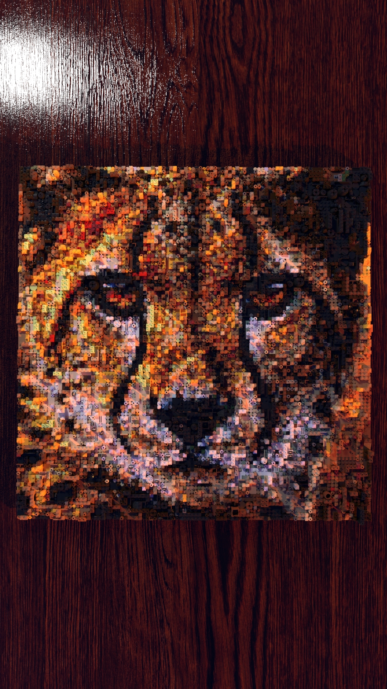
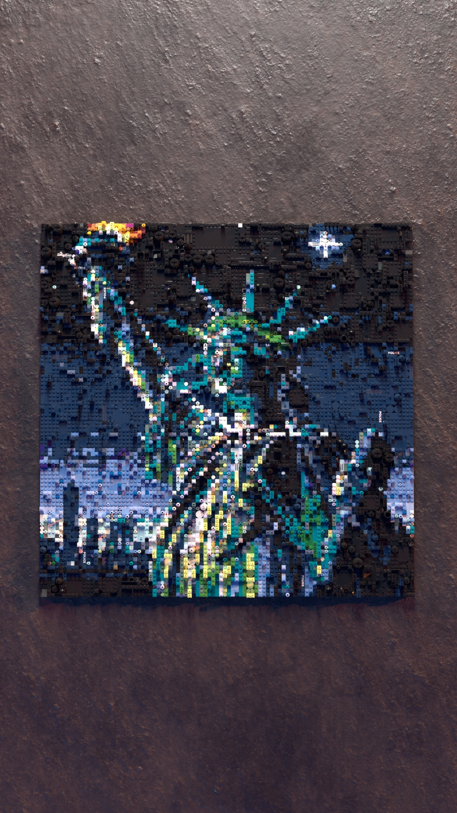
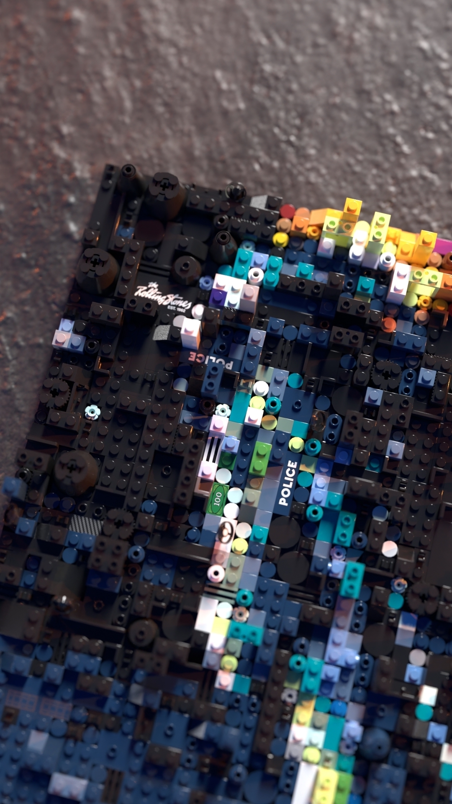

# Mosaibrick: Algorithmic LEGO Art Generation Platform


Mosaibrick is a sophisticated backend system that transforms digital images into custom, buildable LEGO mosaics by generating cost-optimized parts lists, 3D models, and step-by-step PDF building instructions. 

---

## Photorealistic Render Gallery

Here are some examples of mosaics rendered through the automated pipeline.

<p align="center">
  
  
  
  
</p>

---

## Core Features

* **Custom Optimization Engine:** A multi-objective optimization engine for brick placement, balancing cost and piece variety. 
* **Advanced Image Processing:** A pipeline using OpenCV and computer vision algorithms for pixelation, color mapping, and region detection. 
* **Automated 3D Model Generation:** Programmatically generates multi-part 3D models in LDR/MPD format. 
* **Automated PDF Instructions:** Integrates with LPub3D to automatically produce multi-page, professional-quality building instruction manuals. 
* **Data-Driven Inventory:** Supports integration with LEGO Pick-a-Brick and other sources for real-time inventory and pricing data. 

---

## Technical Architecture

The system is built on a high-performance Python backend designed for complex data processing and automation.

### High-Level Data Flow

```
Input Image → Image Processing Pipeline → Optimization Engine → 3D Model Generation → Output Pipelines (PDF/Render/Parts List)
```

### Key Technologies

| Category                      | Technologies                                                                                             |
| ----------------------------- | -------------------------------------------------------------------------------------------------------- |
| **Backend Framework** | FastAPI, Uvicorn                                                                                    |
| **Data & Optimization** | Pandas, NumPy, SciPy, Custom Optimization Algorithms                                              |
| **Image Processing & Vision** | OpenCV, Pillow, Matplotlib, LAB Color Space Conversions                                           |
| **3D Modeling & Automation** | LDraw Integration, LPub3D Service Integration, Blender API (`bpy`)                            |
| **Deployment & Infrastructure** | Heroku, AWS EC2, AWS S3                                                                             |

---

## Project Status

* ✅ **Backend:** Complete. The core logic, optimization engine, and all output automation pipelines are fully functional.
* 👨‍💻 **Frontend:** Under Active Development.
